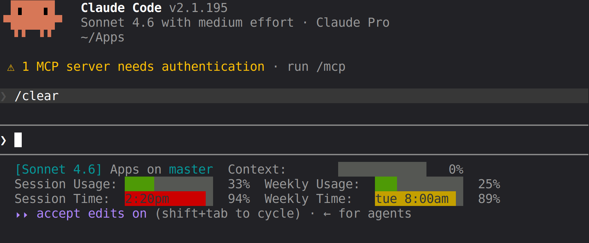

 https://private-user-images.githubusercontent.com/267214723/614772637-8a296da7-84ad-4fe3-a3a4-bafa6420f2c4.png?jwt=eyJ0eXAiOiJKV1QiLCJhbGciOiJIUzI1NiJ9.eyJpc3MiOiJnaXRodWIuY29tIiwiYXVkIjoicmF3LmdpdGh1YnVzZXJjb250ZW50LmNvbSIsImtleSI6ImtleTUiLCJleHAiOjE3ODI3NjA0MzksIm5iZiI6MTc4Mjc2MDEzOSwicGF0aCI6Ii8yNjcyMTQ3MjMvNjE0NzcyNjM3LThhMjk2ZGE3LTg0YWQtNGZlMy1hM2E0LWJhZmE2NDIwZjJjNC5wbmc_WC1BbXotQWxnb3JpdGhtPUFXUzQtSE1BQy1TSEEyNTYmWC1BbXotQ3JlZGVudGlhbD1BS0lBVkNPRFlMU0E1M1BRSzRaQSUyRjIwMjYwNjI5JTJGdXMtZWFzdC0xJTJGczMlMkZhd3M0X3JlcXVlc3QmWC1BbXotRGF0ZT0yMDI2MDYyOVQxOTA4NTlaJlgtQW16LUV4cGlyZXM9MzAwJlgtQW16LVNpZ25hdHVyZT1jODFlNmE1NjAzOGNiYjljOGYwNWUxNjA1NGJmNGM4NDYyNjI3MmMzODI3Yjg3ZDg1ZTMzMzVlYWNjOTM2ZmM1JlgtQW16LVNpZ25lZEhlYWRlcnM9aG9zdCZyZXNwb25zZS1jb250ZW50LXR5cGU9aW1hZ2UlMkZwbmcifQ.KLT2Abzzm3D4R_PTdawn3DTAhmM2TpmX65-kbnSK4zk# claude-code-statusline

A custom status line for [Claude Code](https://claude.ai/code) that shows context usage, session and weekly token usage, and reset times — all as color-coded background-fill bars.



```
[Claude Sonnet 4.6] myproject on main    Context:          25%
Session Usage:               40%    Weekly Usage:     18%
Session Time:  11:42pm       62%    Weekly Time:  tue 3:00pm  44%
```

Bars are green below 70%, yellow from 70–89%, red at 90%+.

## Requirements

- Python 3
- Claude Code
- Session/Weekly bars require a paid Claude.ai subscription and only appear after the first API response in a session

## Installation

1. Copy `statusline.sh` to `~/.claude/`:

   ```bash
   cp statusline.sh ~/.claude/statusline.sh
   chmod +x ~/.claude/statusline.sh
   ```

2. Add to `~/.claude/settings.json`:

   ```json
   {
     "statusLine": {
       "type": "command",
       "command": "~/.claude/statusline.sh"
     }
   }
   ```

3. Restart Claude Code.

## Notes

- Context bar is always visible; Session and Weekly bars are subscriber-only and appear after the first API call each session.
- Reset times are shown in your local timezone inside the Session Time and Weekly Time bars.
- Tested on Linux and macOS.
